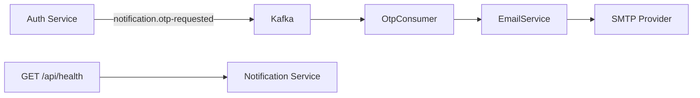

<div align="center">

# Notification Service

### Sends account OTP emails reliably after auth events are published to Kafka.

[Overview](#overview) · [Quick Start](#quick-start) · [Configuration](#configuration) · [Architecture](#architecture) · [API](#api)

</div>

---

## Overview

Authentication systems should not block registration or password recovery on email delivery code. This service keeps that responsibility isolated: it listens for notification events from Kafka, renders OTP email content, and sends it through SMTP.

It is part of the Bin E-Commerce microservice system and is built with NestJS 11, KafkaJS, Mongoose, Nodemailer, and a custom operational health endpoint.

---

## What It Does

- Consumes `notification.otp-requested` Kafka events.
- Sends OTP emails for registration, reset-password, and login verification flows.
- Exposes `GET /api/health` for Docker and orchestration health checks.
- Enables Swagger documentation outside production at `/docs`.
- Keeps SMTP configuration in environment variables instead of source code.

---

## Quick Start

```bash
cp .env.example .env
npm install
npm run dev
```

The service starts on port `3006` by default.

```text
[notification-service] Running on port 3006
```

Health check:

```bash
curl http://localhost:3006/api/health
```

Expected response:

```json
{
  "status": "ok",
  "service": "notification-service",
  "version": "1.0.0",
  "environment": "development",
  "timestamp": "2026-05-10T03:30:00.000Z",
  "uptimeSeconds": 42,
  "checks": {
    "http": { "status": "ok" },
    "kafka": {
      "status": "configured",
      "brokers": ["localhost:9092"]
    },
    "mongodb": {
      "status": "up",
      "name": "bin_notification",
      "host": "localhost"
    },
    "smtp": {
      "status": "configured",
      "host": "smtp.gmail.com",
      "port": 587
    },
    "memory": {
      "status": "ok",
      "rssMb": 92,
      "heapUsedMb": 38,
      "heapTotalMb": 54
    }
  }
}
```

---

## Configuration

Create `.env` from `.env.example` and fill in environment-specific values.

| Variable | Required | Default | Purpose |
| --- | --- | --- | --- |
| `NODE_ENV` | No | `development` | Controls production-only behavior such as Swagger visibility. |
| `PORT` | No | `3006` | HTTP port for health checks and docs. |
| `MONGODB_URI` | No | `mongodb://localhost:27017/bin_notification` | MongoDB connection string reserved for notification persistence. |
| `KAFKA_BROKERS` | No | `localhost:9092` | Comma-separated Kafka broker list. |
| `SMTP_HOST` | No | `smtp.gmail.com` | SMTP host used by Nodemailer. |
| `SMTP_PORT` | No | `587` | SMTP port. Use `465` for secure SMTP. |
| `SMTP_USER` | Yes | none | SMTP username and sender email. |
| `SMTP_PASSWORD` | Yes | none | SMTP password or app password. |

---

## See It Work

The Auth Service publishes an OTP event:

```ts
await kafkaProducer.publish("notification.otp-requested", {
  email: "customer@example.com",
  otp: "123456",
  purpose: "REGISTER",
  expiresIn: 600,
});
```

The Notification Service consumes the event and sends an email:

```text
Received OTP request for customer@example.com [purpose=REGISTER]
OTP email sent to customer@example.com [purpose=REGISTER]
```

---

## Architecture



<details>
<summary><b>Runtime Flow</b></summary>

1. `Auth Service` creates and stores an OTP challenge.
2. It publishes a `notification.otp-requested` event to Kafka.
3. `OtpConsumer` receives the event in consumer group `notification-service`.
4. `EmailService` renders the email body and sends it through Nodemailer.
5. Failures are logged so the consumer does not crash the HTTP process.

</details>

<details>
<summary><b>Project Structure</b></summary>

```text
src/
  app.module.ts
  main.ts
  kafka/
    consumers/
      otp.consumer.ts
  modules/
    email/
      email.module.ts
      email.service.ts
    health/
      health.controller.ts
      health.module.ts
```

</details>

---

## API

| Method | Path | Description |
| --- | --- | --- |
| `GET` | `/api/health` | Liveness endpoint for Docker, Compose, and monitoring probes. |
| `GET` | `/docs` | Swagger UI in non-production environments. |

Kafka event contract:

```ts
interface OtpRequestedPayload {
  email: string;
  otp: string;
  purpose: "REGISTER" | "RESET_PASSWORD" | "LOGIN";
  expiresIn: number;
}
```

---

## Scripts

```bash
npm run dev          # Start in watch mode
npm run build        # Compile NestJS app
npm run start        # Run compiled dist/main
npm run type-check   # TypeScript check without emitting files
npm run test         # Run Jest tests
```

---

## Docker

Build from the monorepo root:

```bash
docker build -f services/notification-service/Dockerfile -t bin-ecommerce/notification-service:local .
```

Run with env file:

```bash
docker run --env-file services/notification-service/.env -p 3006:3006 bin-ecommerce/notification-service:local
```

---

## Reliability Notes

- OTP values are generated by the Auth Service; this service only delivers the message.
- SMTP secrets must stay in `.env` or deployment secrets, never in source control.
- Kafka brokers can be supplied as a comma-separated list for multi-broker deployments.
- Email failures are logged with recipient and purpose for operational debugging.

---

## License

Private project for the Bin E-Commerce platform.
